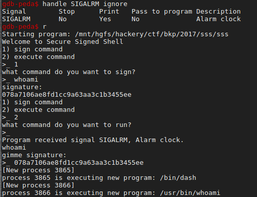

For this challenge we were given an unstripped binary.
```
Welcome to Secure Signed Shell
1) sign command
2) execute command
>_
```

## Some Reverse Engineering

Here are the important parts of the `sign_it` function.

```c
void sign_it()
{
    .
    .
    .
    puts("what command do you want to sign?");
    printf(">_ ");
    bytes_read = read(0, g_cmd_to_exec, 256);
    g_cmd_to_exec[bytes_read] = 0;
    if (
        !strcmp(g_cmd_to_exec, "ls\n") ||
        !strcmp(g_cmd_to_exec, "pwd\n") ||
        !strcmp(g_cmd_to_exec, "id\n") ||
        !strcmp(g_cmd_to_exec, "whoami\n"))
    {
        if ( g_hash_type )
        {
          *hmac = HMAC(
                EVP_md5(g_key, g_cmd_to_exec),
                g_key,
                strlen(g_key),
                g_cmd_to_exec,
                strlen(g_cmd_to_exec),
                md_len);
        }
        else
        {
          *hmac = HMAC(
                EVP_sha1(g_key, g_cmd_to_exec),
                g_key,
                strlen(g_key),
                g_cmd_to_exec,
                strlen(g_cmd_to_exec),
                md_len);
        }
        puts("signature: ");
        for ( i = 0; i < *md_len; ++i )
            printf("%02x", hmac[i]);
        puts(g_newline);
        }
    else
    {
      puts("not going to sign that for you...");
    }
}
```
So now we have a better idea of how this program was intended to be used. It looks like we have a few harmless "allowed" commands. It will then use the [HMAC](https://en.wikipedia.org/wiki/Hash-based_message_authentication_code) algorithm to sign the command if it is allowed. Earlier in the program `g_key` is initialized to the flag, so we won't be able to predict what the signature will be. Once we are ready to execute the command, the program will check the signature of the command and if it is correct, it will execute the command.



I believe we are dealing with two structs and a few global values, which I will elaborate on more later.
```c
typedef struct sss_sha1 {
    char signature[20];
    int (*deny)(char *);
    int (*exec)(char *);
}sss_sha1;
typedef struct sss_md5 {
    char signature[19];
    int (*deny)(char *);
    int (*exec)(char *);
}sss_md5;

sss_sha1* exec_guy;
void *g_key;
char g_cmd_to_exec[256];
int g_hash_type
const char *g_newline = "\n";
```

Let's take a look at the important bits of the `execute_it` function. First, if the global `exec_guy` struct has not already been alocated by the `sign_it` function, it is allocated here.

```c
sss_sha1 *s_exec_guy;
sss_md5 *m_exec_guy;
char *signature_ptr;
if ( !exec_guy )
{
  exec_guy = calloc(36, 1);
  s_exec_guy = exec_guy;
  m_exec_guy = exec_guy+1;
  s_exec_guy->deny = deny_command;
  s_exec_guy->exec = exec_command;
}
signature_ptr = (char*)m_exec_guy;
if ( !g_hash_type )
  signature_ptr = (char*)s_exec_guy;
```
  After memory is allocated on the heap for the `exec_guy` struct, the `exec` and `deny` function pointers in the struct are set to the `deny_command` and `exec_command` functions respectively.
```c
int deny_command(char *cmd)
{
  return printf("wrong signature for %s - it wasn't signed by me\n", cmd);
}
int exec_command(char *cmd)
{
  return system(cmd);
}

```
Then, the function checks `g_hash_type`. `signature_ptr` is set to `m_exec_guy`, unless the value of `g_hash_type` is `NULL`, in which case it is set to `s_exec_guy`.
##Off By One Error
```c
puts("what command do you want to run?");
printf(">_ ");
bytes_read = read(0, g_cmd_to_exec, 256);
g_cmd_to_exec[bytes_read] = 0; // here we can write a zero to `g_hash_type`
```
The `g_cmd_to_exec` buffer is 256 bytes, so here we have the classic newbie mistake of an [off by one error ](https://en.wikipedia.org/wiki/Off-by-one_error).  Let's take a look at where `g_command_to_exec` is in memory.

So it looks like we can write a zero to `g_hash_type`.
##One Byte Overflow
Here is the next bit of the `execute_it` function
```c
if ( g_hash_type )
{
  hmac = HMAC(
      EVP_md5(g_key, g_cmd_to_exec),
      g_key,
      strlen(g_key),
      g_cmd_to_exec,
      strlen(g_cmd_to_exec),
      md_len);
}
else
{
  hmac = HMAC(
      EVP_sha1(g_key, g_cmd_to_exec),
      g_key,
      strlen(g_key),
      g_cmd_to_exec,
      strlen(g_cmd_to_exec),
      md_len);
}
memcpy(signature_ptr, hmac, *md_len);  // one byte overflow
  ```
  So if `g_hash_type` is `NULL`, then an MD5 hash will be used for the `HMAC` function, otherwise a SHA1 hash will be used.
  If the signature that the user supplies matches the signature generated by the `sign_it` function, then the `exec` function pointer is called, otherwise the `deny` function pointer is called. 
```c
if ( !strcmp(signed_cmd, input_signature) )
    m_exec_guy->exec(g_cmd_to_exec);
else
    m_exec_guy->deny(g_cmd_to_exec);
puts(g_newline);
```

Notice that `m_exec_guy` is being used in this snippet. The program is expecting an MD5 hash to be generated, resulting a signature of length `0x10`. However, because we are able to write a zero to `g_hash_type`, we can force the program to use a SHA1 hash, resulting in a signature of length `0x14`. Recall that in the case of the `sss_md5` struct the `deny` function pointer is located `0x13` bytes away from the beginning of its `signature` buffer. Thus, we have the ability to overwrite the least significant bit of the `deny` function pointer with the last byte of the generated signature.

* The address of `exec_command` is `0x400D5B` 
* The address of `deny_command` is `0x400D36`

Only a one byte difference! We are now ready to attack this mess of a program.
## Full Exploit
* Select the option to execute a command
* Send a payload of exactly 256 bytes so that a zero will be written to `g_hash_type`

```
"/bin/sh" + <random junk>
```
* Repeat this with a different payload until an signature is generated with  the last byte being `0x5b`

